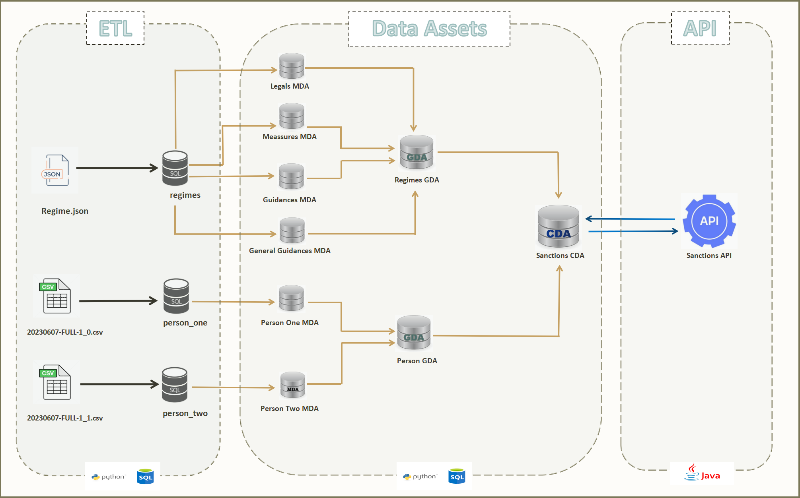

# Sanctions

## Requirements
The requirements for this project is to create a scalable back-end solution for individuals sanctioned by EU and/or UN. 
The solution should contain the following:
-  Database for storage
-  API enpoint(s) delivering the data in json format
-  The API must be able to deliver all the data represented on https://www.sanctionsmap.eu

Note: Content on the website is provided under Creative Commons Attribution 4.0 International (CC BY 4.0) licence. This means that reuse is allowed, provided appropriate credit is given and changes are indicated.

## Proposed Solution

This design is suggested to enable decoupling of the back-end and front-end. Currently, the website in question performs logic on it's data in the front-end. This will make it harder to scale and can lead to issues rendering the front-end unusable if the logic is incorrect. 
Having the data structure proposed will allow for future enrichment of the data and more control without impacting the api and/or front-end.
